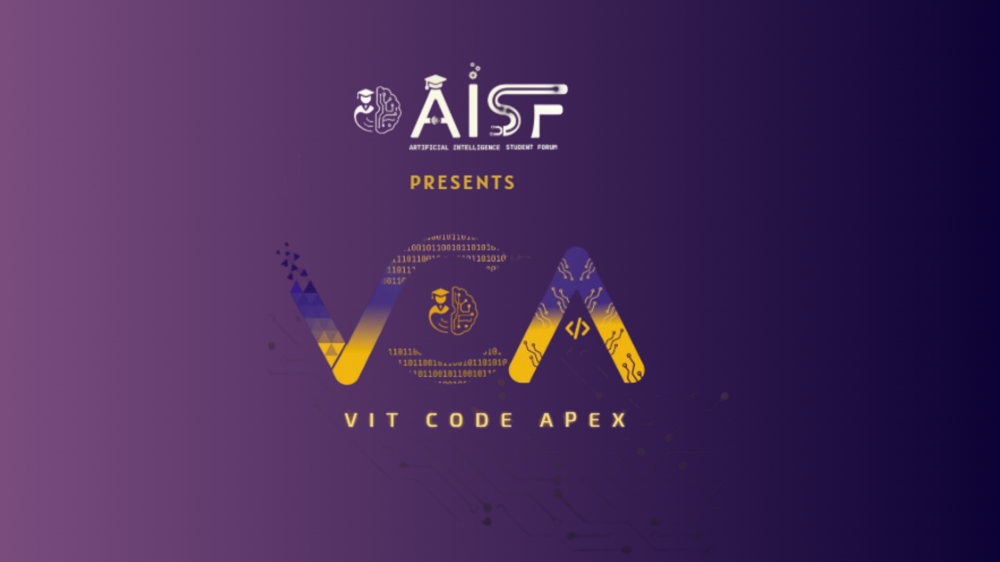

# Automated Marine Biofouling Analysis

**An intelligent image-based solution to automatically classify fouling species and estimate their density on submerged naval assets.**

## 🎥 Live Demo

**https://preview--fouling-spotter-ai.lovable.app/**

## 🌊 The Problem: Marine Biofouling

Marine biofouling is the undesirable accumulation of organisms on submerged surfaces, a significant challenge for the Indian Navy. This buildup increases drag on ships, leading to reduced speed, higher fuel consumption, and increased maintenance costs. It also poses a biosecurity risk by transporting invasive species. Manual inspection is slow, subjective, and requires specialized expertise, making it difficult to scale across a fleet.

_Figure: Example of heavy macrofouling on a test panel._

## 💡 Our Solution:

**BioFouling Detection** is an end-to-end deep learning framework that automates the analysis of biofouling. By leveraging **semantic segmentation**, our system moves beyond simple detection to provide a detailed, pixel-level map of fouled surfaces. This allows for precise species classification and accurate density measurement, delivering actionable intelligence for maintenance and operational planning.

## 📝 Project Presentation

Here is the complete presentation outlining our vision, technical approach, and potential impact.

### **Slide 1: Title**

### **Slide 2: Idea Title**

### **Slide 3: Proposed Solution**

### **Slide 4: Technical Approach**

### **Slide 5: Feasibility and Viability**

### **Slide 6: Impact and Benefits**

## ⚙️ Technical Architecture

Our application is structured as an end-to-end pipeline, from image acquisition to delivering operational outputs via a user-friendly dashboard.

## ✨ Key Features

- **Automated Species Classification:** Uses a powerful U-Net model to identify various types of fouling like barnacles, tubeworms, bryozoans, and slime.

- **Accurate Density Estimation:** Calculates the precise percentage of surface area covered by each species, eliminating the guesswork of manual methods.

- **Novel Performance Metrics:** Generates advanced insights, such as identifying organisms in **direct contact with the hull**, a critical factor for evaluating antifouling coatings.

- **Scalable and Objective:** Provides a standardized, data-driven approach that can be deployed across the entire fleet for consistent and repeatable analysis.

## 🛠️ Technology Stack

- **AI/ML Framework:** TensorFlow / Keras

- **Model Architecture:** Adapted U-Net with a pre-trained EfficientNet B2 Encoder

- **Backend:** Python (Flask/FastAPI) for the API and processing server

- **Frontend:** A modern web framework (e.g., React) for the user dashboard

## 🚀 How It Works

1. **Upload Image:** A user uploads a high-resolution image of a fouled surface through the web interface.

2. **AI Analysis:** The image is sent to the processing server, where it is preprocessed and fed into the Foul-Seg segmentation model.

3. **Generate Report:** The model outputs a detailed segmentation map. The server calculates the density of each species and other key metrics.

4. **View Results:** The user receives a comprehensive report on the dashboard, including the annotated image and quantitative data visualizations.

## 👥 Team

- **Riya Kotalwar** - Team Lead Image Model Training.

- **Shreyas Jadhav** - Full Stack and Image Segmentation, Second in Command

- **Pranav KUnjir** - Full Stack and AI model Training
